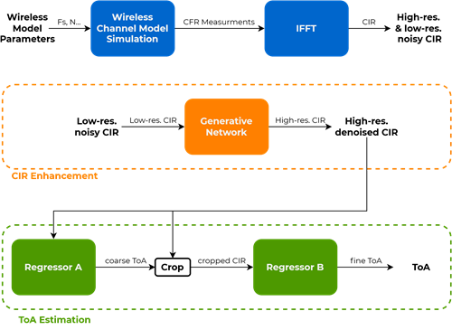

# Path Delay Estimation

Final project in EE at Tel-Aviv Univeristy supervised by Toga Networks. Implementation of super-resolution Time of Arrival (TOA) estimation using neural networks for indoor geolocation applications, based on the 2020 paper "Super-Resolution Time-of-Arrival Estimation using Neural Networks" by Hsiao et al.

## Project Overview



This project implements a deep learning approach to estimate Time of Arrival (TOA) of radio frequency (RF) signals from channel frequency response (CFR) measurements. The system uses a two-stage neural network architecture:

1. **CIR Enhancement Stage**: A generator network extends the effective bandwidth and produces high-resolution Channel Impulse Response (CIR) while performing denoising.

2. **TOA Estimation Stage**: A cascade of two regressor networks estimates TOA - first coarsely, then refined by focusing on the region of interest around the initial estimate.

## Key Features

- Implementation of model-based deep learning for TOA estimation
- Wireless channel model simulation for training data generation
- High-resolution CIR generation through bandwidth extension
- Coarse-to-fine TOA estimation architecture
- Support for both high and low SNR scenarios
- Comparison with traditional estimation methods

## Repository Structure

```
path-delay-estimation/
├── data/               # Training and test datasets
├── model/             # Neural network model implementations
│   ├── layers.py      # Custom layer definitions
│   ├── loss.py        # Loss function implementations
│   └── network.py     # Network architecture definitions
├── test/              # Test and evaluation scripts
└── train/             # Training scripts
```

## Installation

1. Clone the repository:
```bash
git clone https://github.com/DannyS032/path-delay-estimation.git
cd path-delay-estimation
```

2. Install dependencies:
```bash
pip install torch numpy h5py matplotlib tqdm papaparse sheetjs mathjs lodash
```

## Usage

1. Generate training data:
```bash
python training_data_generation.py
```

2. Train the models:
```bash
python train.py
```

3. Run evaluation:
```bash
python test.py
```

## Performance

The implemented system achieves:
- 9-58% improved root mean squared error (RMSE) for distance ranging
- Up to 22% improved false detection rate compared to conventional super-resolution algorithms
- Enhanced performance in low SNR conditions
- Improved resolution capability for closely spaced multipath components

## Technical Requirements

- Python 3.8+
- PyTorch 1.7+ 
- CUDA-capable GPU (recommended for training)
- 16GB RAM minimum

## Contributing

This is a research implementation. Contributions are welcome through pull requests. Please ensure:
- Code follows the existing style
- New features include appropriate tests
- Documentation is updated accordingly

## Citation

If you use this code in your research, please cite:
```
@inproceedings{hsiao2020super,
  title={Super-Resolution Time-of-Arrival Estimation using Neural Networks},
  author={Hsiao, Yao-Shan and Yang, Mingyu and Kim, Hun-Seok},
  booktitle={European Signal Processing Conference (EUSIPCO)},
  year={2020}
}
```

## License

This project is licensed under the MIT License - see the LICENSE file for details.

## Contact

Danny Sinder - danny.sinder@email.com

Project Link: https://github.com/DannyS032/path-delay-estimation

## Acknowledgments

- Original paper authors for the theoretical foundation
- Toga Networks for project support
- The open-source community for various tools and libraries used in this implementation
